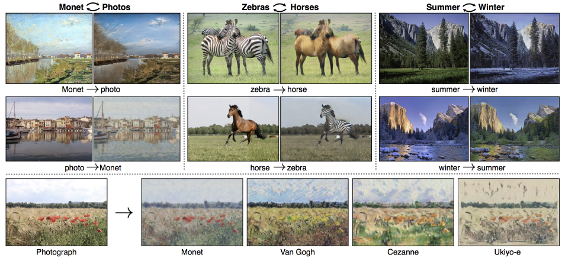
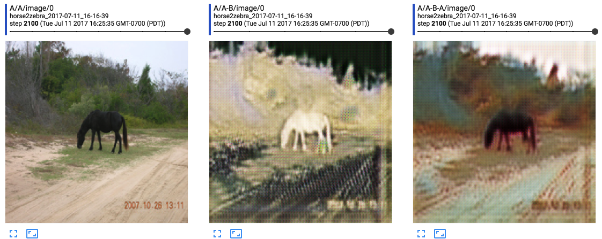
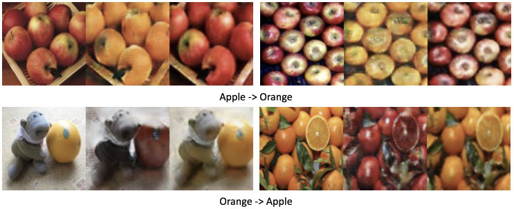
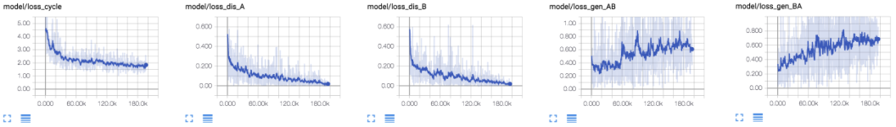
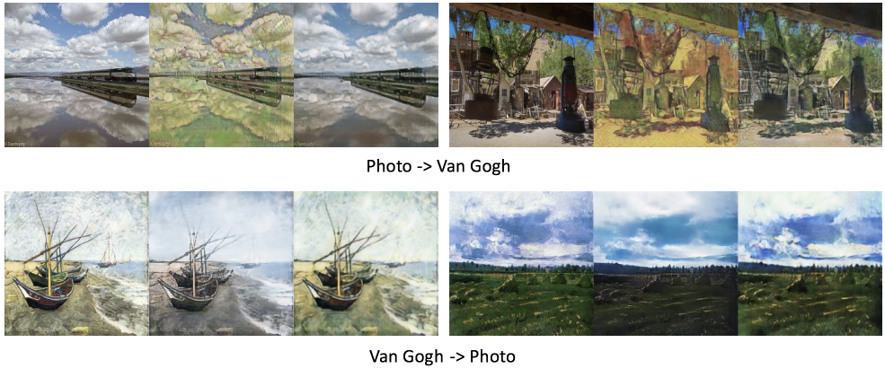
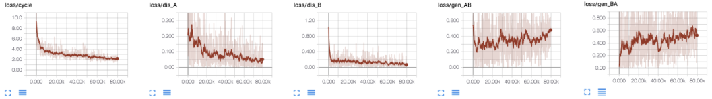

# CycleGAN implementation in Tensorflow

As part of the implementation series of [Joseph Lim's group at USC](http://csail.mit.edu/~lim), our motivation is to accelerate (or sometimes delay) research in the AI community by promoting open-source projects. To this end, we implement state-of-the-art research papers, and publicly share them with concise reports. Please visit our [group github site](https://github.com/gitlimlab) for other projects.

This project is implemented by [Youngwoon Lee](https://github.com/youngwoon) and the codes have been reviewed by [Honghua Dong](https://github.com/dhh1995) before being published.

## Description

This repo is a [Tensorflow](https://www.tensorflow.org/) implementation of CycleGAN on Pix2Pix datasets: [Unpaired Image-to-Image Translation using Cycle-Consistent Adversarial Networks](https://arxiv.org/abs/1703.10593).

This paper presents a framework addressing the **image-to-image translation** task, where we are interested in converting an image from one domain (e.g., zebra) to another domain (e.g., horse). It transforms a given image by finding an one-to-one mapping between unpaired data from two domains.

The framework consists of two generators and two discriminators. Generator *G_ab* aims to translate an image in domain *a* (zebra) to its domain *b* version (horse); while generator *G_ba* aims to translate an image in domain *b* to its domain *a* version. On the other hand, discriminator *D_a* verifies whether given images are in domain *a* or not; so does discriminator *D_b*. 

Therefore, the entire frameowrk consists of two loops of GANs which are trained to perform image-to-image translation *a*->*b*->*a* and *b*->*a*->*b*. When training these GANs, a **cycle-consistent loss**, which is a sum of reconstruction errors (*a*->*b*->*a* and *b*->*a*->*b*), is added to the adversarial loss. Without one-to-one mapping between two domains *a* and *b*, the framework cannot reconstruct original image and it leads to the large cycle-consistent loss. Therefore, the cycle-consistent loss alleviates the issue of mode collapse by imposing one-to-one mapping between two domains.



## Dependencies

- Ubuntu 16.04
- Python 2.7
- [Tensorflow 1.1.0](https://www.tensorflow.org/)
- [NumPy](https://pypi.python.org/pypi/numpy)
- [SciPy](https://pypi.python.org/pypi/scipy)
- [Pillow](https://pillow.readthedocs.io/en/4.0.x/)
- [tqdm](https://github.com/tqdm/tqdm)
- [h5py](http://docs.h5py.org/en/latest/)

## Usage

- Execute the following command to download the specified dataset as well as train a model:

```
$ python cycle-gan.py --task apple2orange --image_size 256
```

- To reconstruct 256x256 images, set `--image_size` to 256; otherwise it will resize to and generate images in 128x128.
  Once training is ended, testing images will be converted to the target domain and the results will be saved to `./results/apple2orange_2017-07-07_07-07-07/`.
- Available datasets: apple2orange, summer2winter_yosemite, horse2zebra, monet2photo, cezanne2photo, ukiyoe2photo, vangogh2photo, maps, cityscapes, facades, iphone2dslr_flower, ae_photos


- Check the training status on Tensorboard:

```
$ tensorboard --logdir=./logs
```

> **Carefully check Tensorboard for the first 1000 iterations. You need to run the experiment again if dark and bright regions are reversed like the exmaple below. This GAN implementation is sensitive to the initialization.**



## Results

### apple2orange





### vangogh2photo





## References

- [Unpaired Image-to-Image Translation using Cycle-Consistent Adversarial Networks](https://arxiv.org/abs/1703.10593)
- [Instance Normalization: The Missing Ingredient for Fast Stylization](https://arxiv.org/abs/1607.08022)
- The official implementation in Torch: https://github.com/junyanz/CycleGAN
  - The data downloading script is from the author's code.

